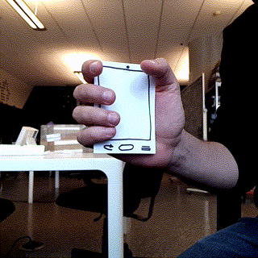

---
published: true
date: 2019-01-17 T00:00:00.000Z
title: Ideas for experiments
--- 

## 01 Discrete positions and shaking

Sensing motion into discrete positions, for use as some kind of rhythm game. This would be done comparing the position of "whiskers" sensors that were calibrated earlier. Might work better in Unity.

This could be used for musical experiments and could be compounded with the proximity sensor to create more complex motions. It could also be coupled with a multitouch "hold" to the phone: this would also change motion considerably.

## 02 Tug of war / marble puzzle

Again with a multitouch hold, players would use the accelerometers and gyros to make a pointer slowly move onscreen so that it can reach targets. This might be too close to Bounden. Another thing that could be done with this basic setup is some sort of variations using changes on other sensors such as temperature or proximity.